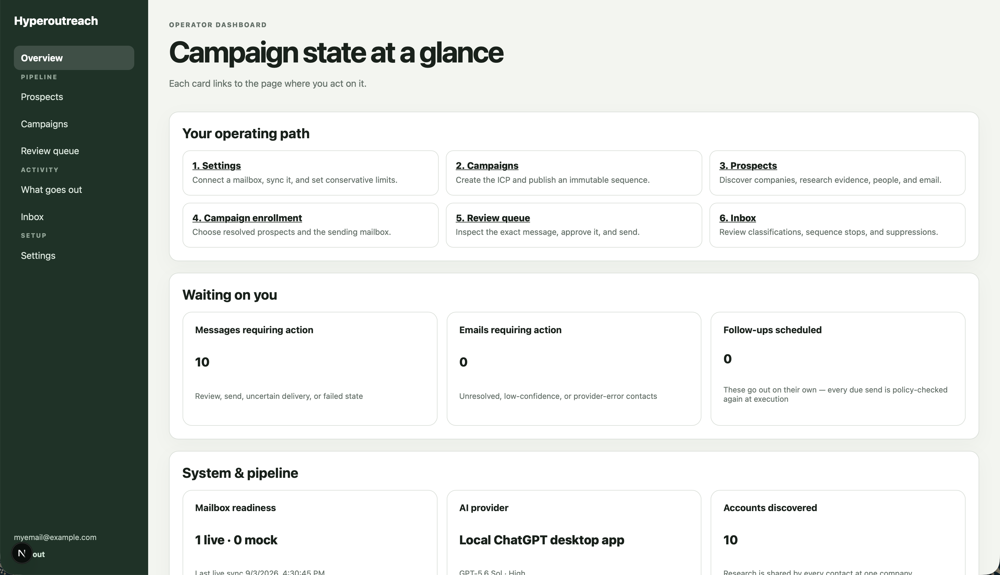

# Hyperoutreach

**A self-hosted prospecting and customer-discovery tool for one person.** It finds
companies that match your ICP, researches them, resolves work email addresses from
public evidence, writes a message grounded in that evidence — and then asks you to
approve it before anything leaves your mailbox.



## What it is

Hyperoutreach is a Next.js monolith with PostgreSQL as the single source of truth.
It runs on your machine, sends from your own mailbox, and uses **your ChatGPT
desktop app** for every AI task — there is no API key and no per-token bill. It
integrates no data broker: addresses come from public evidence the model cites,
or the contact stays unresolved and says why.

It is deliberately single-operator. Every first message is written by the machine
and sent by a human.

## How you use it

The dashboard lays out the same six steps:

1. **Settings** — connect a mailbox (Microsoft 365 or SMTP/IMAP), sync it, set
   conservative daily caps.
2. **Campaigns** — define the ICP and publish an immutable sequence version.
3. **Prospects** — discover companies, research them, find people, resolve
   addresses.
4. **Campaign enrollment** — pick resolved prospects and the sending mailbox.
5. **Review queue** — read the exact message that will be sent, then approve, edit,
   reject, or send it.
6. **Inbox** — reply classification, sequence stops, suppressions.

A seventh page, **What goes out** (`/outbound`), reports the pipeline's yield beside
its cost: who is alive on which address, what bounced, which conventions are
demoted at which companies, and whether the background cycle is actually running.

## Design principles

These are the constraints the code is built around, not aspirations:

- **No first send is system-originated.** Follow-ups go out on their own; the first
  message always waits for a human.
- **PostgreSQL owns business state.** Workflow executors run durable work; they
  never become the source of truth.
- **No invented addresses.** An address comes from cited public evidence and an
  inferred company convention, or the contact records a typed reason
  (`insufficient_public_evidence`, `low_confidence`, `mx_missing`, …).
- **A bounce advances, it does not condemn.** A contact holds an ordered _ladder_
  of evidenced addresses; a proven-dead one suppresses that address permanently and
  offers the next rung for review. See [the address ladder](docs/address-ladder.md).
- **Silence is never a signal.** Not delivery, not failure. The only positive
  delivery evidence this product accepts is something coming back.
- **A company is researched once.** One company search is reused for every contact
  there for thirty days, so ten colleagues cost one live search.
- **Everything is audited.** `agent_runs`, `workflow_events` and `state_transitions`
  record every model call, its prompt/schema version, sources, cost availability and
  sanitized failures.
- **Every provider has a deterministic mock twin**, so the whole application runs and
  is tested credential-free.

## Requirements

- Node.js 22+, npm 11+
- Docker, with the standalone `docker-compose` binary — the npm database scripts
  call it by that name, not `docker compose` (PostgreSQL and a local GreenMail server)
- **macOS, for live AI only.** `AI_PROVIDER=chatgpt_desktop` drives the ChatGPT
  macOS app over its devtools port. It must be installed and signed in, and either
  closed — the bridge launches it hidden — or already running with
  `--remote-debugging-port=9333`, since macOS ignores the flag for an app that is
  already open. On any other platform the default
  `AI_PROVIDER=mock` keeps the full application working, deterministically.

## Quick start

```bash
cp .env.example .env.local
```

**Stop and replace every placeholder in `.env.local` before starting.** The
checked-in values are deliberately invalid so a copied configuration fails closed:

- `OPERATOR_PASSWORD` — at least 12 characters
- `OPERATOR_API_TOKEN` — at least 32 random characters (the local worker refuses to
  start without it)
- `SESSION_SECRET` — at least 32 random bytes
- `TOKEN_ENCRYPTION_KEYS` — a base64 32-byte AES-256-GCM key (`openssl rand -base64 32`)
  and its ID in `TOKEN_ENCRYPTION_ACTIVE_KEY_ID`
- confirm `DATABASE_URL`, `TEST_DATABASE_URL`, and the provider settings

Keep those values in `.env.local` or a secret manager only. Then:

```bash
npm ci
npm run db:up       # PostgreSQL on 127.0.0.1:55432, plus the test database
npm run db:migrate
npm run dev
```

Open <http://localhost:3000> and sign in with `OPERATOR_EMAIL` / `OPERATOR_PASSWORD`.
`/api/health` returns 200 only when PostgreSQL is reachable.

`npm run dev` starts a supervisor owning both Next.js and the local maintenance
worker, which runs the ordered cycle every minute — inbound mail, due follow-ups,
stale recovery, then the operator command queue. No cron or foreground loop needed.

**Do not seed a real installation.** Migrations create the schema and nothing else;
connect your real mailbox from Settings. For a demonstration database only,
`npm run db:seed:mock` adds a deterministic mock mailbox.

## Providers

Each seam has a credential-free default. Nothing ever silently falls back — a
misconfiguration is an explicit startup error.

| Seam      | Variable            | Default | Live options                                     |
| --------- | ------------------- | ------- | ------------------------------------------------ |
| AI        | `AI_PROVIDER`       | `mock`  | `chatgpt_desktop` (macOS, your own subscription) |
| Mail      | `MAIL_PROVIDER`     | `mock`  | `microsoft_graph`, or per-mailbox SMTP/IMAP      |
| Workflows | `WORKFLOW_PROVIDER` | `local` | `trigger` (Trigger.dev Cloud)                    |

Research runs `AI_RESEARCH_MODEL` at `AI_RESEARCH_EFFORT` (web search allowed);
personalization and reply classification run the faster `AI_FAST_*` lane.
`chatgpt_desktop` requires `WORKFLOW_PROVIDER=local` — a hosted worker has no
desktop app to drive.

## Development

```bash
npm run format:check && npm run lint && npm run typecheck
npm run test              # unit
npm run test:integration  # real PostgreSQL + TLS IMAP/SMTP round trip
npm run test:e2e          # Playwright, production build, mock providers
npm run eval              # versioned quality fixture with per-metric thresholds
npm run build
```

Two probes spend live turns on your ChatGPT window and are deliberately outside the
suite: `npm run probe:personalization` and `npm run probe:public-email`.

## Architecture

```
src/app        App Router UI and HTTP endpoints
src/modules    domain behaviour (campaigns, contacts, email-resolution,
               messages, replies, research, workflows, …)
src/lib/db     Drizzle schema and the server-only connection
src/lib/*      provider adapters (chatgpt-desktop, microsoft, smtp-imap)
trigger        Trigger.dev entrypoints only; behaviour stays in src/modules
drizzle        the SQL migration history
tests          unit / integration / e2e
```

AI, mail, and workflow implementations sit behind narrow adapters. Deterministic
application policy — not a model — decides what may be sent, retried, deduplicated,
or suppressed.

## Status

The credential-free path is complete and verified end to end, including a rendered
Chromium lifecycle test. The ChatGPT desktop adapter has been driven against the
real app. Microsoft Graph and Trigger.dev adapters are implemented and
contract-tested; their live verification needs your own credentials.

## Further reading

- [Discovery, research, and email resolution](docs/research-and-email.md) — how
  companies, people, and addresses are found and what is refused
- [The address ladder](docs/address-ladder.md) — bounces, demotion, and the bounds
  that pause rather than condemn
- [Mailboxes](docs/mailboxes.md) — Microsoft 365 OAuth and webhooks, SMTP/IMAP
- [Durable workflows](docs/workflows.md) — the maintenance cycle, local executor,
  Trigger.dev
- [The ChatGPT desktop bridge](docs/chatgpt-desktop-bridge.md) — how it works, and
  what it deliberately does not do
- [Database workflow and schema](docs/database.md)
- [Authentication and secrets](docs/security.md) — sessions, CSRF, the login rate
  limit and why it is shaped that way, secret rotation
- [Validation](docs/validation.md) — the test suite, the eval fixture, the probes
- [`SPEC.md`](SPEC.md) — the original architecture document (French; its AI
  transport is superseded, the code is the source of truth)

## License

[MIT](LICENSE)
